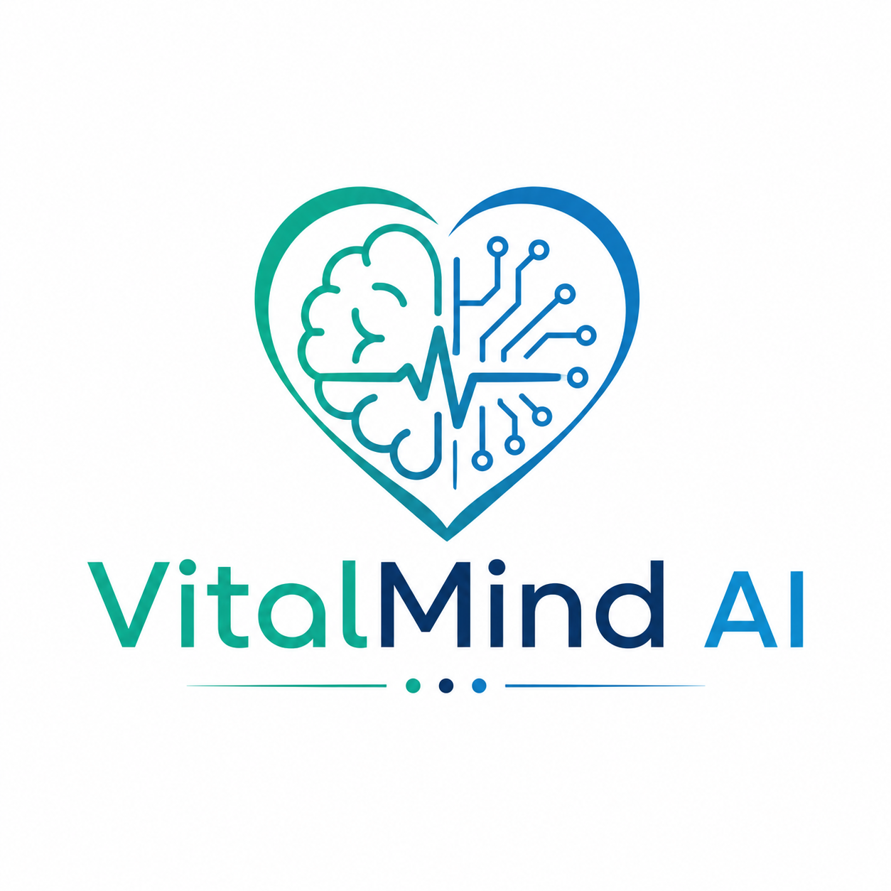
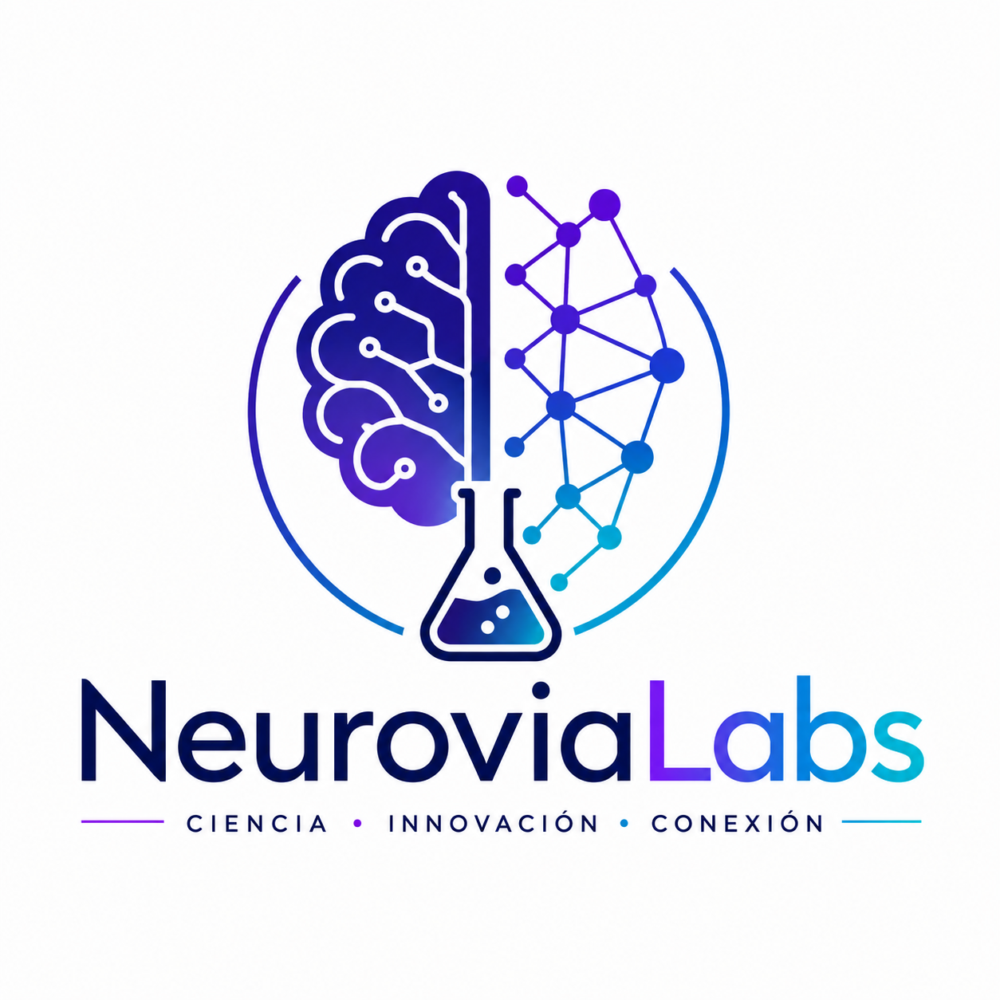
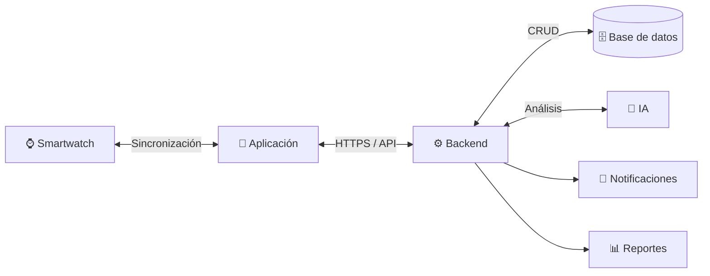

<div align="center">

# 🩺 VitalMind AI

### Plataforma inteligente para el monitoreo y seguimiento integral de la salud

<p align="center">
  
  
  
  
  
  
</p>

</div>

<br>

<p align="center">
  
  &nbsp;&nbsp;&nbsp;&nbsp;&nbsp;&nbsp;&nbsp;&nbsp;
  
</p>


---

## 🩺 ¿Qué es VitalMind AI?

**VitalMind AI** es una plataforma de monitoreo y seguimiento de la salud diseñada para centralizar información personal relacionada con mediciones, actividad física, descanso, medicamentos, síntomas y hábitos.

El sistema contempla la integración con un **smartwatch compatible**, permitiendo recopilar las métricas que la plataforma wearable seleccionada proporcione. La información puede ser consultada mediante historiales, gráficas, tendencias, alertas informativas y resúmenes apoyados por inteligencia artificial.

---

## ✨ Características principales

| Funcionalidad                  | Descripción                                                      |
| ------------------------------ | ---------------------------------------------------------------- |
| 🔐 **Autenticación**           | Registro e inicio de sesión de usuarios                          |
| ⌚ **Smartwatch**               | Vinculación y sincronización con dispositivo wearable compatible |
| ❤️ **Frecuencia cardiaca**     | Consulta de mediciones disponibles                               |
| 🫁 **Oxigenación**             | Seguimiento de saturación de oxígeno cuando sea compatible       |
| 🩸 **Presión arterial**        | Registro cuando el dispositivo y plataforma lo permitan          |
| 🚶 **Actividad física**        | Pasos, actividad y métricas disponibles                          |
| 😴 **Sueño y descanso**        | Consulta de periodos y métricas disponibles                      |
| 💊 **Medicamentos**            | Registro de medicamentos, dosis y horarios                       |
| 🔔 **Recordatorios**           | Notificaciones y recordatorios configurables                     |
| 📊 **Historial**               | Consulta de mediciones y registros anteriores                    |
| 📈 **Tendencias**              | Visualización de evolución mediante gráficas                     |
| 📝 **Síntomas y hábitos**      | Registro manual de información personal                          |
| 🤖 **Inteligencia artificial** | Resúmenes y análisis informativos                                |
| 🚨 **Alertas**                 | Avisos informativos configurables                                |
| 📄 **Reportes**                | Generación y consulta de información resumida                    |
| 🔒 **Privacidad**              | Protección de cuenta y datos personales                          |

---

## 🎯 Objetivo general

Desarrollar una solución digital integrada por una aplicación y un smartwatch que permita **recopilar, almacenar, consultar y analizar información relacionada con la salud del usuario**, facilitando el seguimiento de mediciones, actividad, medicamentos, hábitos y tendencias mediante interfaces accesibles, recordatorios y herramientas de análisis.

---

## 🎯 Objetivos específicos

* Definir los requisitos funcionales y no funcionales del sistema.
* Diseñar la arquitectura aplicación → smartwatch → backend → datos → análisis.
* Crear una interfaz accesible para consultar información personal.
* Sincronizar las métricas disponibles mediante la plataforma wearable seleccionada.
* Gestionar medicamentos, dosis, horarios y recordatorios.
* Permitir el registro manual de síntomas y hábitos.
* Presentar historiales, gráficas y tendencias.
* Generar alertas informativas configurables.
* Incorporar análisis e inteligencia artificial con alcance **no diagnóstico**.
* Implementar mecanismos de autenticación y protección de datos.
* Realizar pruebas funcionales, de seguridad, sincronización, usabilidad y rendimiento.

---

# 🧩 Problemática

Actualmente, las mediciones obtenidas mediante dispositivos inteligentes, los registros de actividad, el sueño, los medicamentos y las observaciones personales pueden encontrarse distribuidos en diferentes aplicaciones o medios.

Esta fragmentación dificulta obtener una visión general de la información personal y reconocer tendencias a lo largo del tiempo.

**VitalMind AI propone centralizar esta información en una sola plataforma**, permitiendo que el usuario consulte sus datos de manera organizada y comprensible.

---

# 🚀 Propuesta de solución

VitalMind AI plantea una arquitectura compuesta por:

```text
                    ┌──────────────────────┐
                    │      SMARTWATCH      │
                    │  Sensores / Métricas  │
                    └──────────┬───────────┘
                               │
                               ▼
                    ┌──────────────────────┐
                    │     APLICACIÓN       │
                    │   Interfaz de usuario│
                    └──────────┬───────────┘
                               │
                               ▼
                    ┌──────────────────────┐
                    │   BACKEND / API      │
                    │ Lógica de negocio    │
                    └───────┬───────┬──────┘
                            │       │
                 ┌──────────┘       └──────────┐
                 ▼                             ▼
        ┌─────────────────┐          ┌─────────────────┐
        │    DATABASE     │          │   IA / ANÁLISIS │
        │ Datos personales│          │   Información   │
        └─────────────────┘          └─────────────────┘
```

La integración con sensores y métricas depende de las capacidades reales, permisos, SDK y API de la plataforma wearable seleccionada.

---

# 🏗️ Arquitectura



### Flujo principal

```text
Smartwatch
     │
     ▼
Recopilación de métricas
     │
     ▼
Aplicación
     │
     ▼
API / Backend
     │
     ├──────────────► Base de datos
     │
     ├──────────────► Motor de análisis
     │
     ├──────────────► Inteligencia artificial
     │
     └──────────────► Notificaciones
                         │
                         ▼
                    Usuario final
```

---

# 📊 Datos contemplados

VitalMind AI contempla trabajar con diferentes tipos de información:

### ❤️ Mediciones

* Frecuencia cardiaca.
* Saturación de oxígeno.
* Presión arterial, cuando exista compatibilidad.
* Pasos.
* Actividad física.
* Descanso.
* Sueño.
* Otras métricas proporcionadas por el dispositivo compatible.

### 💊 Información personal

* Medicamentos.
* Dosis.
* Horarios.
* Confirmaciones manuales.
* Síntomas.
* Hábitos.
* Observaciones personales.

### 📈 Información generada

* Historial de mediciones.
* Tendencias.
* Gráficas.
* Alertas informativas.
* Reportes.
* Resúmenes mediante IA.

---

# 🛠️ Tecnologías

## Tecnologías y herramientas

| Categoría                | Tecnología / herramienta | 
| ------------------------ | ------------------------ | 
| 🗂️ Control de versiones | Git                      | 
| 🌐 Repositorio           | GitHub                   |
| 🎨 Diseño                | Figma                    |
| ⚙️ Backend               | Node.js + Express.js     |
| 🐍 IA / análisis         | Python                   |
| 🚀 API de IA             | FastAPI         |
| 🗄️ Base de datos        | MySQL                  | 
| 🔄 Comunicación          | WebSocket / Socket.IO    |
| 🐳 Contenedores          | Docker                   |
| ☁️ Cloud                 | Servicios de nube        | 


---

# 📱 Funcionalidades

## 👤 Cuenta y perfil

* Registro de usuario.
* Inicio de sesión.
* Perfil personal.
* Configuración de preferencias.
* Gestión de privacidad.

## ⌚ Smartwatch

* Vinculación del dispositivo.
* Sincronización de métricas.
* Consulta de datos disponibles.
* Historial de mediciones.

## ❤️ Monitoreo

* Frecuencia cardiaca.
* Oxigenación.
* Presión arterial compatible.
* Actividad física.
* Pasos.
* Sueño.
* Descanso.

## 💊 Medicamentos

* Registro de medicamentos.
* Dosis.
* Horarios.
* Recordatorios.
* Confirmación manual de toma.

## 📊 Análisis

* Gráficas.
* Tendencias.
* Historial.
* Resúmenes.
* Reportes.
* Alertas informativas.
* Análisis apoyado por IA.

---

# 🔐 Seguridad y privacidad

La plataforma considera la protección de la información personal como uno de sus componentes fundamentales.

Entre las medidas contempladas se encuentran:

* 🔐 Autenticación de usuarios.
* 🛡️ Protección de sesiones.
* 🔒 Comunicaciones mediante HTTPS/TLS.
* 🗄️ Protección de información almacenada.
* 👤 Separación de datos por usuario.
* 🚫 Restricción de acceso a información de terceros.
* 🔑 Gestión segura de credenciales.
* 📱 Control de permisos relacionados con el smartwatch.

Cada usuario debe acceder exclusivamente a su propia información.

---

# ⚠️ Alcance médico

VitalMind AI se plantea como una **herramienta de apoyo para el seguimiento personal**.

El sistema:

* ❌ No realiza diagnósticos médicos.
* ❌ No prescribe medicamentos.
* ❌ No modifica tratamientos.
* ❌ No sustituye una consulta médica.
* ❌ No debe utilizarse como único criterio para tomar decisiones clínicas.

Las alertas y análisis generados por la plataforma tienen carácter **informativo** y dependen de la calidad y disponibilidad de los datos proporcionados.

---

# 📂 Estructura del repositorio

```text
VitalMind_AI_Corregido/
│
├── 📄 README.md
│
├── assets/
│   └── branding/
│       ├── neurovialabs_logo_.png
│       └── vitalmind_logo.png
│
└── docs/
    │
    ├── 01-inicio-proyecto/
    ├── 02-objetivos/
    ├── 03-justificacion/
    ├── 04-descripcion-proyecto/
    ├── 05-gestion-alcance/
    ├── 06-publico-objetivo/
    ├── 07-tecnologias/
    ├── 08-seguridad/
    ├── 09-recursos-humanos/
    ├── 10-interesados/
    ├── 11-tiempo/
    ├── 12-costos/
    ├── 13-adquisiciones/
    ├── 14-comunicacion/
    ├── 15-calidad/
    ├── 16-riesgos/
    ├── 17-plan-pruebas/
    ├── 18-cierre/
    |── 19-evidencias/

```

---

# 📚 Documentación

|  # | Documento                | Enlace                                                                                     |
| -: | ------------------------ | ------------------------------------------------------------------------------------------ |
| 01 | Inicio del proyecto      | [Ver documento](docs/01-inicio-proyecto/Inicio_Proyecto_VitalMindAI.docx)                  |
| 02 | Objetivos                | [Ver documento](docs/02-objetivos/Objetivos_VitalMindAI.docx)                              |
| 03 | Justificación            | [Ver documento](docs/03-justificacion/Justificacion_VitalMindAI.docx)                      |
| 04 | Descripción del proyecto | [Ver documento](docs/04-descripcion-proyecto/Descripcion_Proyecto_VitalMindAI.docx)        |
| 05 | Alcance y requerimientos | [Ver documento](docs/05-gestion-alcance/Gestion_Alcance_y_Requerimientos_VitalMindAI.docx) |
| 06 | Público objetivo         | [Ver documento](docs/06-publico-objetivo/Publico_Objetivo_y_Valor_Agregado.docx)           |
| 07 | Tecnologías              | [Ver documento](docs/07-tecnologias/Tecnologias_Utilizadas_VitalMindAI.docx)               |
| 08 | Seguridad                | [Ver documento](docs/08-seguridad/Seguridad_SSL_TLS_Cifrado.docx)                          |
| 09 | Recursos humanos         | [Ver documento](docs/09-recursos-humanos/Gestion_Recursos_Humanos_VitalMindAI.docx)        |
| 10 | Interesados              | [Ver documento](docs/10-interesados/Gestion_Interesados_VitalMindAI.docx)                  |
| 11 | Gestión del tiempo       | [Ver documento](docs/11-tiempo/Gestion_Tiempo_VitalMindAI.docx)                            |
| 12 | Costos                   | [Ver documento](docs/12-costos/Gestion_Costos_VitalMindAI.docx)                            |
| 13 | Adquisiciones            | [Ver documento](docs/13-adquisiciones/Gestion_Adquisiciones_VitalMindAI.docx)              |
| 14 | Comunicación             | [Ver documento](docs/14-comunicacion/Gestion_Comunicacion_VitalMindAI.docx)                |
| 15 | Calidad                  | [Ver documento](docs/15-calidad/Gestion_Calidad_VitalMindAI.docx)                          |
| 16 | Riesgos                  | [Ver documento](docs/16-riesgos/Gestion_Riesgos_VitalMindAI.docx)                          |
| 17 | Plan de pruebas          | [Ver documento](docs/17-plan-pruebas/Plan_Pruebas_VitalMindAI.docx)                        |
| 18 | Cierre                   | [Ver documento](docs/18-cierre/Cierre_Proyecto_VitalMindAI.docx)                          |
| 19 | Evidencias                   | [Ver documento](docs/19-evidencias/reuniones)                          |

---

# 📅 Gestión del proyecto

La documentación del proyecto contempla diferentes áreas de gestión:

```text
                    VITALMIND AI
                         │
       ┌─────────────────┼─────────────────┐
       │                 │                 │
       ▼                 ▼                 ▼
    ALCANCE           TIEMPO            COSTOS
       │                 │                 │
       ├──────────────┬──┴──┬──────────────┤
       │              │     │              │
       ▼              ▼     ▼              ▼
  RECURSOS        CALIDAD  RIESGOS    ADQUISICIONES
       │              │     │              │
       └──────────────┴─────┴──────────────┘
                         │
                         ▼
                  PLAN DE PRUEBAS
```

---

# 👥 Equipo

| Integrante                     | 
| ------------------------------ | 
| **Yazmin Gutierrez Hernandez** | 
| **Obed Guzmán Flores**         | 
| **Citlalli Perez Dionicio**    | 
| **Michelle Castro Otero**      | 
| **Carlos Daniel Garcia Pluma** | 
| **Jennifer Bautista Barrios**  | 

Los roles específicos y la gestión de recursos humanos se encuentran documentados en:

[`docs/09-recursos-humanos/`](docs/09-recursos-humanos/)

---

# 🎓 Información académica

**Universidad:** Universidad Tecnológica de Xicotepec de Juárez

**Carrera:** Ingeniería en Desarrollo y Gestión de Software

**Grupo:** 9A

**Periodo:** Mayo – Agosto 2026

**Empresa :** NeuroviaLabs


---

# ⚠️ Limitaciones

La disponibilidad de determinadas métricas depende directamente del smartwatch y de la plataforma seleccionada.

Por lo tanto:

* No todos los dispositivos proporcionan las mismas mediciones.
* Algunas métricas pueden requerir permisos específicos.
* La frecuencia de sincronización depende del dispositivo.
* La precisión depende de los sensores utilizados.
* Las funciones de IA dependen de la implementación final.
* Las tecnologías marcadas como propuesta pueden cambiar durante el desarrollo.

---

# 🌐 Identidad del proyecto

### VitalMind AI

**Plataforma inteligente para el monitoreo y seguimiento integral de la salud.**

### NeuroviaLabs

**Empresa  bajo la cual se desarrolla el proyecto académico.**

---

