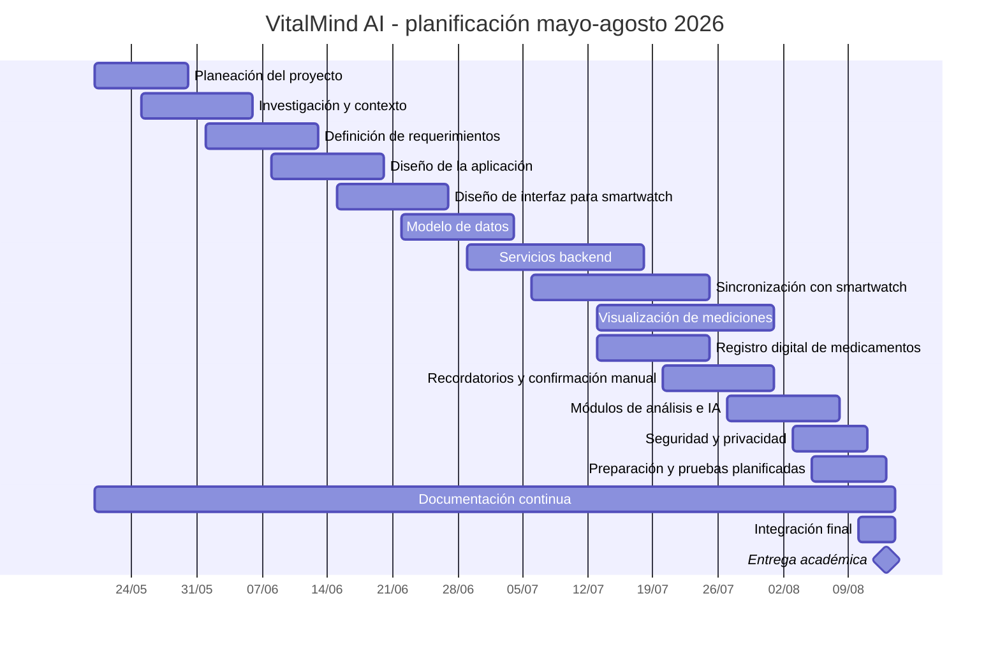

# Diagrama de Gantt - VitalMind AI

Las fechas representan **planificación académica** dentro del periodo mayo-agosto de 2026. Una barra en el cronograma no prueba por sí sola que la actividad haya sido ejecutada.

## Responsables y dependencias

| ID | Actividad | Responsable | Dependencia | Estado |
|---|---|---|---|---|
| T01 | Planeación del proyecto | Yazmin Gutierrez Hernandez | Inicio | Planificación académica |
| T02 | Investigación y contexto | Obed Guzmán Flores | Planeación | Planificación académica |
| T03 | Definición de requerimientos | Obed Guzmán Flores | Investigación | Planificación académica |
| T04 | Diseño de la aplicación | Yazmin Gutierrez Hernandez | Requerimientos | Planificación académica |
| T05 | Diseño de interfaz para smartwatch | Yazmin Gutierrez Hernandez | Diseño aplicación | Planificación académica |
| T06 | Modelo de datos | Michelle Castro Otero | Requerimientos | Planificación académica |
| T07 | Servicios backend | Carlos Daniel Garcia Pluma / Jennifer Bautista Barrios | Modelo de datos | Planificación académica |
| T08 | Sincronización con smartwatch | Carlos Daniel Garcia Pluma / Jennifer Bautista Barrios | Backend / selección wearable | Planificación académica |
| T09 | Visualización de mediciones | Yazmin Gutierrez Hernandez | Datos / diseño | Planificación académica |
| T10 | Registro digital de medicamentos | Jennifer Bautista Barrios | Backend | Planificación académica |
| T11 | Recordatorios y confirmación manual | Carlos Daniel Garcia Pluma | Registro medicamentos | Planificación académica |
| T12 | Módulos de análisis e IA | Michelle Castro Otero | Datos disponibles | Planificación académica |
| T13 | Seguridad y privacidad | Carlos Daniel Garcia Pluma | Backend | Planificación académica |
| T14 | Preparación y pruebas planificadas | Citlalli Perez Dionicio | Módulos integrables | Planificación académica |
| T15 | Documentación continua | Obed Guzmán Flores | Inicio | En elaboración académica |
| T16 | Integración final | Equipo completo | Módulos priorizados | Planificación académica |
| T17 | Entrega académica | Equipo completo | Integración y documentos | Hito programado |